# Titanic: Machine Learning from Disaster

Ya Liu

ya.liu1@simon.rochester.edu

https://github.com/yaliu0703

https://www.linkedin.com/in/yaliu1/

In this project, I trained a model using the Titanic dataset from Kaggle for predicting whether a passenger may survive the sinking of Titanic. The project is carried out in three parts: data exploration, feature engineering and model training. Performance of final model is 81%.

# 1. Data Exploration

## 1.1 Load data


```R
library('ggplot2')
library('dplyr')
library('randomForest')
library('plyr')
library('grid')
library('RColorBrewer')
train <- read.csv('train.csv')
test  <- read.csv('test.csv')
comp  <- bind_rows(train, test) 
comp <- dplyr::tbl_df(comp)
comp$Set <- NA
comp$Set[1:nrow(train)] <- "Train"
comp$Set[(nrow(train)+1):nrow(comp)] <- "Test"
```

    
    Attaching package: ‘dplyr’
    
    
    The following objects are masked from ‘package:stats’:
    
        filter, lag
    
    
    The following objects are masked from ‘package:base’:
    
        intersect, setdiff, setequal, union
    
    
    randomForest 4.6-14
    
    Type rfNews() to see new features/changes/bug fixes.
    
    
    Attaching package: ‘randomForest’
    
    
    The following object is masked from ‘package:dplyr’:
    
        combine
    
    
    The following object is masked from ‘package:ggplot2’:
    
        margin
    
    
    ------------------------------------------------------------------------------
    
    You have loaded plyr after dplyr - this is likely to cause problems.
    If you need functions from both plyr and dplyr, please load plyr first, then dplyr:
    library(plyr); library(dplyr)
    
    ------------------------------------------------------------------------------
    
    
    Attaching package: ‘plyr’
    
    
    The following objects are masked from ‘package:dplyr’:
    
        arrange, count, desc, failwith, id, mutate, rename, summarise,
        summarize
    
    
    Warning message in bind_rows_(x, .id):
    “Unequal factor levels: coercing to character”
    Warning message in bind_rows_(x, .id):
    “binding character and factor vector, coercing into character vector”
    Warning message in bind_rows_(x, .id):
    “binding character and factor vector, coercing into character vector”
    Warning message in bind_rows_(x, .id):
    “Unequal factor levels: coercing to character”
    Warning message in bind_rows_(x, .id):
    “binding character and factor vector, coercing into character vector”
    Warning message in bind_rows_(x, .id):
    “binding character and factor vector, coercing into character vector”
    Warning message in bind_rows_(x, .id):
    “Unequal factor levels: coercing to character”
    Warning message in bind_rows_(x, .id):
    “binding character and factor vector, coercing into character vector”
    Warning message in bind_rows_(x, .id):
    “binding character and factor vector, coercing into character vector”
    Warning message in bind_rows_(x, .id):
    “Unequal factor levels: coercing to character”
    Warning message in bind_rows_(x, .id):
    “binding character and factor vector, coercing into character vector”
    Warning message in bind_rows_(x, .id):
    “binding character and factor vector, coercing into character vector”


## 1.2 Descriptive analysis


```R
str(comp)
summary(comp)
```

    Classes ‘tbl_df’, ‘tbl’ and 'data.frame':	1309 obs. of  13 variables:
     $ PassengerId: int  1 2 3 4 5 6 7 8 9 10 ...
     $ Survived   : int  0 1 1 1 0 0 0 0 1 1 ...
     $ Pclass     : int  3 1 3 1 3 3 1 3 3 2 ...
     $ Name       : chr  "Braund, Mr. Owen Harris" "Cumings, Mrs. John Bradley (Florence Briggs Thayer)" "Heikkinen, Miss. Laina" "Futrelle, Mrs. Jacques Heath (Lily May Peel)" ...
     $ Sex        : Factor w/ 2 levels "female","male": 2 1 1 1 2 2 2 2 1 1 ...
     $ Age        : num  22 38 26 35 35 NA 54 2 27 14 ...
     $ SibSp      : int  1 1 0 1 0 0 0 3 0 1 ...
     $ Parch      : int  0 0 0 0 0 0 0 1 2 0 ...
     $ Ticket     : chr  "A/5 21171" "PC 17599" "STON/O2. 3101282" "113803" ...
     $ Fare       : num  7.25 71.28 7.92 53.1 8.05 ...
     $ Cabin      : chr  "" "C85" "" "C123" ...
     $ Embarked   : chr  "S" "C" "S" "S" ...
     $ Set        : chr  "Train" "Train" "Train" "Train" ...


      PassengerId      Survived          Pclass          Name          
     Min.   :   1   Min.   :0.0000   Min.   :1.000   Length:1309       
     1st Qu.: 328   1st Qu.:0.0000   1st Qu.:2.000   Class :character  
     Median : 655   Median :0.0000   Median :3.000   Mode  :character  
     Mean   : 655   Mean   :0.3838   Mean   :2.295                     
     3rd Qu.: 982   3rd Qu.:1.0000   3rd Qu.:3.000                     
     Max.   :1309   Max.   :1.0000   Max.   :3.000                     
                    NA's   :418                                        
         Sex           Age            SibSp            Parch      
     female:466   Min.   : 0.17   Min.   :0.0000   Min.   :0.000  
     male  :843   1st Qu.:21.00   1st Qu.:0.0000   1st Qu.:0.000  
                  Median :28.00   Median :0.0000   Median :0.000  
                  Mean   :29.88   Mean   :0.4989   Mean   :0.385  
                  3rd Qu.:39.00   3rd Qu.:1.0000   3rd Qu.:0.000  
                  Max.   :80.00   Max.   :8.0000   Max.   :9.000  
                  NA's   :263                                     
        Ticket               Fare            Cabin             Embarked        
     Length:1309        Min.   :  0.000   Length:1309        Length:1309       
     Class :character   1st Qu.:  7.896   Class :character   Class :character  
     Mode  :character   Median : 14.454   Mode  :character   Mode  :character  
                        Mean   : 33.295                                        
                        3rd Qu.: 31.275                                        
                        Max.   :512.329                                        
                        NA's   :1                                              
         Set           
     Length:1309       
     Class :character  
     Mode  :character  
                       
                       
                       
                       


Let's make a intuitive analysis of variables we have first:

1) PassengerId: Seems to be useless for our prediction.

2) Survived: Our predictor, categorical variable.

3) Pclass: Generally speaking, the smaller the class is, the closer the passenger is to the deck. Suppose one passenger is closer to the deck, he or she may get to lifeboats quicker. So Pclass seemes to be useful.

4) Name: It seems that it is not that relevant with survival. But it can be noticed that there are titles in passenger names, which might be helpful.

5) Sex: Accoridng to our common sense, survival rate of women might be higher because of the policy of women first.

6) AGe: Accoridng to our common sense, survival rate of children might be higher because of the policy of children first.

7) SibSp: Can not tell.

8) Parch: It refers to the number of parents and children. Can not tell.

9) Ticket: It refers to ticket number. Can not tell.

10) Fare: We may suppose there is a positive relationship between fare and survival rate.

11) Cabin: It might be relevant since the head of ship bumped into iceberg first.

12) Embarked(登船地点)：Can not tell.


As for missing values, there are a lot of missing values in Age, Fare, Embarked and Cabin.

## 1.3 Correlation

### 1.3.1 Sex,Pclass VS Survived


```R
p <- ggplot(comp %>% filter(Set=='Train'))+scale_fill_brewer(palette = "Pastel1")
p1 <- p+geom_bar(aes(x=Sex,fill=as.factor(Survived)),position="fill")+labs(title="Sex VS Survived")
p2 <- p+geom_bar(aes(x=Pclass,fill=as.factor(Survived)),position="fill")+labs(title="Pclass VS Survived")
p3 <- p+geom_jitter(aes(x=as.factor(Sex),y=as.factor(Pclass),color=as.factor(Survived)))+labs(title="Sex+Pclass VS Survived")+scale_colour_brewer(palette='Set1')
grid.newpage()
pushViewport(viewport(layout = grid.layout(2, 2)))
print(p1, vp = viewport(layout.pos.row=1, layout.pos.col =1))
print(p2, vp = viewport(layout.pos.row=1, layout.pos.col =2))
print(p3, vp = viewport(layout.pos.row=2, layout.pos.col =c(1:2)))
```


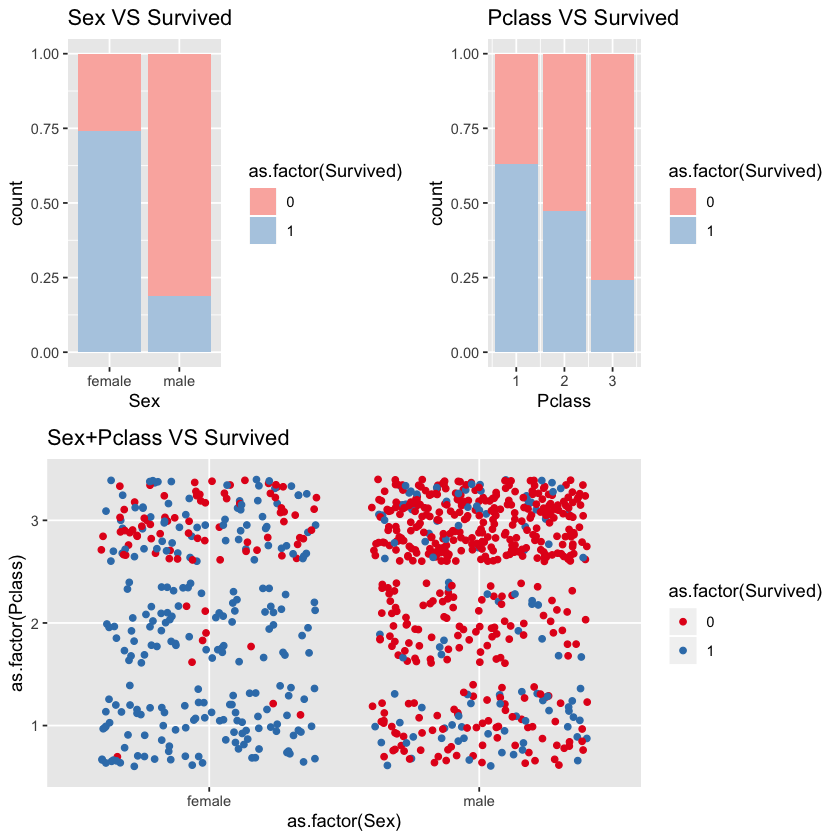


We can see that sex and pclass are highly correlated with survival rate. Women's survival rate is higher than men's. 

From third titled chart Sex+Pclass VS Survivsed, we can see that almost all female passengers in first and second class survived but few male passengers in second and third class survived. Male passengers in the first class and female passengers in the third class may affect model accuracy.


### 1.3.2  Embarked vs Survived vs Pclass


```R
p <- ggplot(comp %>% filter(Set=='Train',Embarked!=''))+scale_fill_brewer(palette = "Pastel1")
p1 <- p+geom_bar(aes(x=as.factor(Embarked),fill=as.factor(Survived)),position="fill")+labs(title="Embarked VS Survived")
p2 <- p+geom_bar(aes(x=as.factor(Pclass),fill=as.factor(Survived)))+labs(title="Embarked VS Pclass VS Survived")+facet_grid(.~Embarked)
p3 <- p+geom_bar(aes(x=as.factor(Sex),fill=as.factor(Survived)))+labs(title="Embarked VS Sex VS Survived")+facet_grid(.~Embarked)
grid.newpage()
pushViewport(viewport(layout = grid.layout(3, 1)))
vplayout = function(x, y) viewport(layout.pos.row = x, layout.pos.col = y)
print(p1, vp = viewport(layout.pos.row =1))
print(p2, vp = viewport(layout.pos.row =2))
print(p3, vp = viewport(layout.pos.row =3))
```


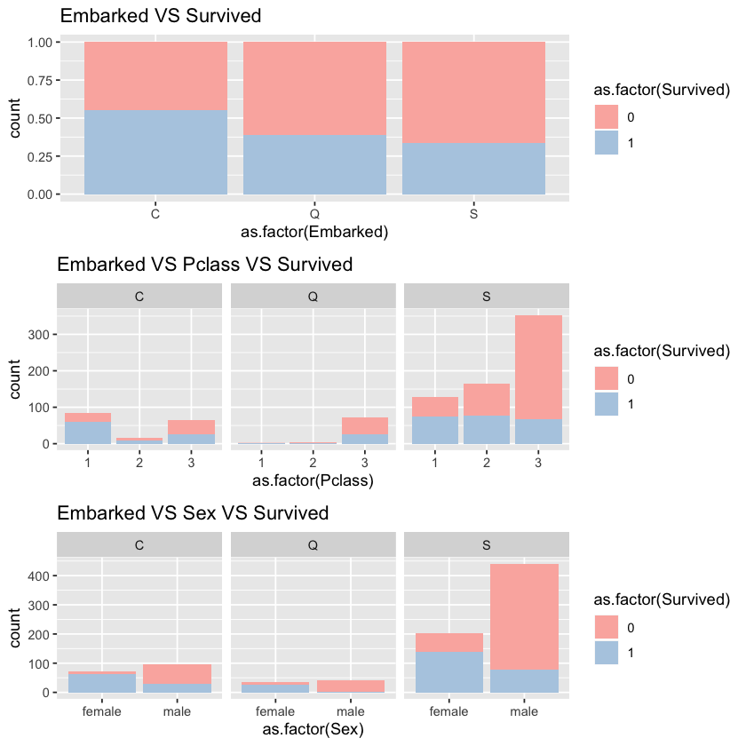


At first glance, the embarked seems to be highly correlated with survival rate. 

According to second and third charts, we can see that:

1) passengers embarked at C are mainly first class passengers. 

2) passengers embarked at Q are mainly third class passengers. 

3) passengers embarked at S are mainly male and third class passengers. 

Therefore, it is not surprising that survival rate of C is higher than that of Q and survival rate of Q is higher than that of S. We may suppose that pclass and sex contribure to the high correlation between embarked and survived.


### 1.3.3 Age VS Survived


```R
ggplot(comp %>% filter(Set=='Train'))+geom_density(aes(x=Age,fill=as.factor(Survived)),alpha=0.7)+labs(title="Age VS Survived")+scale_fill_brewer(palette = "Pastel1")
```

    Warning message:
    “Removed 177 rows containing non-finite values (stat_density).”


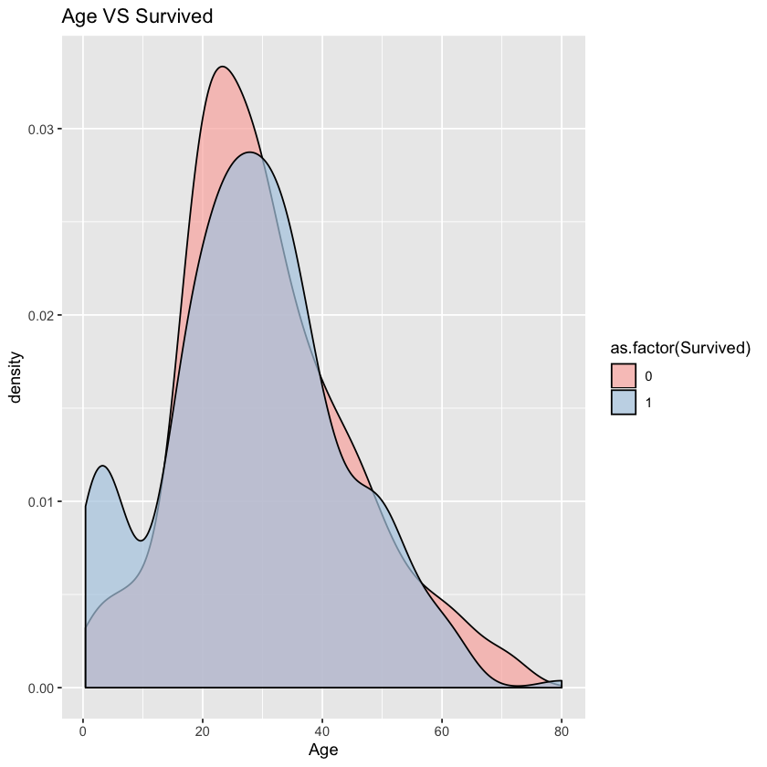


From density chart, we can see that there is an obvious difference between passengers aged under 15. 

### 1.3.4 family size(SibSp+Parch+1) VS Survived


```R
ggplot(comp %>% filter(Set=='Train'))+geom_bar(aes(x=(SibSp+Parch+1),fill=as.factor(Survived)),position="fill")+facet_grid(.~Pclass)+labs(title="Fare VS Survived")+scale_fill_brewer(palette = "Pastel1")
```


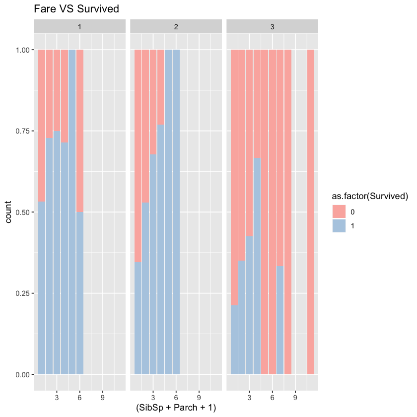


In all three classes, single passengers' survival rate is relatively low. Overall, the survival rate increases first but decreases later as family size grows. So the big or small sized family should be separated from middle-sized family. If we put the family size directly into the model, the model may be affected. We may separate the family size with the threshold of 4 or 5.

### 1.3.5 Fare VS Survived


```R
p1 <- ggplot(comp %>% filter(Set=='Train',Fare<300))+geom_density(aes(x=Fare,fill=as.factor(Survived)),alpha=0.85)+labs(title="Fare VS Survived")+scale_fill_brewer(palette = "Pastel1")+guides(fill=FALSE)
p2 <- ggplot(comp %>% filter(Set=='Train',Pclass==1,Fare<300))+geom_density(aes(x=Fare,fill=as.factor(Survived)),alpha=0.85)+labs(title="Fare for class1 VS Survived")+scale_fill_brewer(palette = "Pastel1")
p3 <- ggplot(comp %>% filter(Set=='Train',Pclass==2,Fare<300))+geom_density(aes(x=Fare,fill=as.factor(Survived)),alpha=0.85)+labs(title="Fare for class2 VS Survived")+scale_fill_brewer(palette = "Pastel1")+guides(fill=FALSE)
p4 <- ggplot(comp %>% filter(Set=='Train',Pclass==3,Fare<300))+geom_density(aes(x=Fare,fill=as.factor(Survived)),alpha=0.85)+labs(title="Fare for class3 VS Survived")+scale_fill_brewer(palette = "Pastel1")+guides(fill=FALSE)
grid.newpage()
pushViewport(viewport(layout = grid.layout(2, 2)))
print(p1, vp = viewport(layout.pos.row=1, layout.pos.col =1))
print(p2, vp = viewport(layout.pos.row=1, layout.pos.col =2))
print(p3, vp = viewport(layout.pos.row=2, layout.pos.col =1))
print(p4, vp = viewport(layout.pos.row=2, layout.pos.col =2))
```


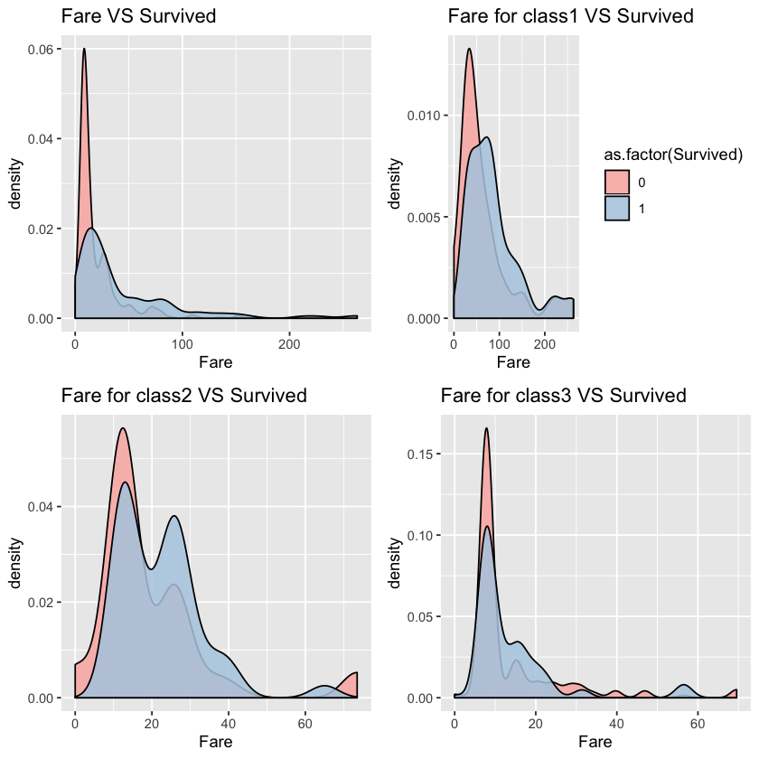


From the first chart, we can see that fare and survived is positvely correlated. After we control the pclass, however, the correlationship is not that obvious. Let's keep this feature first and decide whether to put it into model after testing.

### 1.3.6 Name、Ticket、Cabin VS Sruvived

We can't use these variables now. But we can see whether we can extract useful information from titles in the names, letters in the cabin and number in the ticket in the later feature engineering.

# 2. Feature Engineering

## 2.1 Name->Title、Surname


```R
#replace "," and string starting with "," with ""
comp$Surname <- gsub(',.*', '', comp$Name)
#replace "," and string endding with "," with "". replace "." and string starting with "." with ""
comp$Title <- gsub('(.*, )|(\\..*)', '', comp$Name)
ggplot(comp %>% filter(Set=='Train'))+geom_bar(aes(x=Title,fill=as.factor(Survived)),position="fill")+scale_fill_brewer(palette = "Pastel1")
```


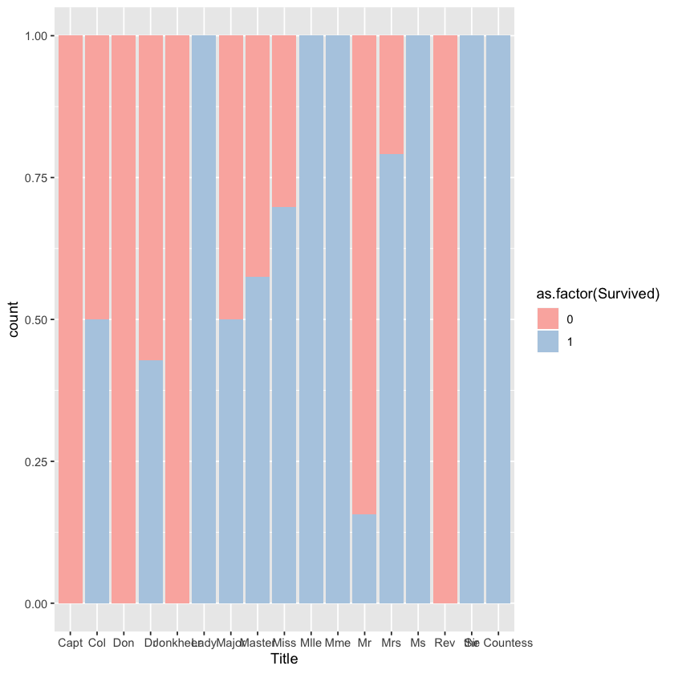


After searching online, I know the meaning of different titles:

Capt: Captain

Col: Colonel

Don: unknown

Dr: Doctor

Jonkheer: unknown

Lady: for female peers with the rank of baroness, viscountess, countess, and marchioness, or the wives of men who hold the equivalent titles. 

Major:military rank 

Master:For male children

Miss:for an unmarried woman

Mile: a male name from the Latin miles, a soldier

Mme:Madam, or madame, is a polite and formal form of address for women,

Mr

Mrs

Ms

Rev:The Reverend is a courtesy title used when addressing a Christian cleric such as an pastor or priest.

Sir:A title of honour for a knight that originates from the Old French word "sieur".

the Countess: is a historical title of nobility in certain European countries,

Let's group these titles.


```R
comp$Title[comp$Title == 'Mlle']<- 'Miss' 
comp$Title[comp$Title == 'Ms']<- 'Miss'
comp$Title[comp$Title == 'Mme']<- 'Mrs' 
pubServ <- c('Capt', 'Col', 'Don', 'Dr', 'Major', 'Rev','Jonkheer')
noble <- c('Dona', 'Lady', 'Sir', 'the Countess')
comp$Title[comp$Title %in% noble]  <- 'Noble'
comp$Title[comp$Title %in% pubServ]  <- 'PublicServant'
ggplot(comp %>% filter(Set=='Train'))+geom_bar(aes(x=Title,fill=as.factor(Survived)),position="fill")+labs(title="Title VS Survived")+scale_fill_brewer(palette = "Pastel1")

```


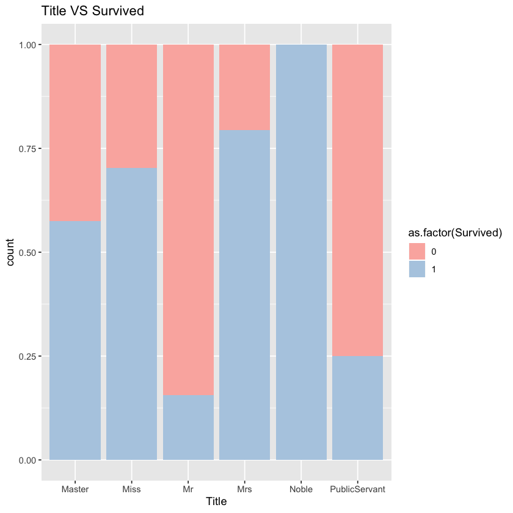


We can see that different groups of people differ in survival rate. 

## 2.2 Age->Child

According to Exploration part, we found that children are more likely to survive. So we want to separate children. To do that, we need to fill in the missing values first with median.


```R
byTitle<-group_by(comp,Title)
titleAge <- data.frame(dplyr:::summarise(byTitle,disp=median(Age,na.rm=T)))
comp[is.na(comp$Age), "Age"] <- apply(comp[is.na(comp$Age), ] , 1, function(x) titleAge[titleAge[, 1]==x["Title"], 2])
comp$Child=NA
comp$Child=ifelse(comp$Age < 18,'Child','Others')
```

## 2.3 SibSp、Parch->GroupSize

Let's define a new variable called GroupSize. According to exploration part, we define group size over 5 as large group.


```R
comp$GroupSize <- comp$SibSp+comp$Parch+1
comp$GroupStyle[comp$GroupSize == 1] <- 'Alone'
comp$GroupStyle[comp$GroupSize < 5 & comp$GroupSize > 1] <- 'Small'
comp$GroupStyle[comp$GroupSize >= 5] <- 'Big'
```

    Warning message:
    “Unknown or uninitialised column: 'GroupStyle'.”


## 2.4 Filling Embarked

As there are only two missing values in Embarked, we replace missing values in Embarked with median.


```R
comp$Embarked[which(comp$Embarked=='')]=median(comp$Embarked)
```

## 2.5 Filling Fare and->FareSingle

Fill missing values of fare with median


```R
byPclass<-group_by(comp,Pclass)
farePclass <- data.frame(dplyr:::summarise(byPclass,disp=median(Fare,na.rm=T)))
comp[is.na(comp$Fare), "Fare"] <- apply(comp[is.na(comp$Fare), ] , 1, function(x) farePclass[farePclass[, 1]==x["Pclass"], 2])
```

## 2.6 Ticket-> TicketStyle

Try extracting useful information from ticket and cabin to prove that passengers' seat is relevant with survival rate. 

To avoid excessive information on ticket, we construct the feature of initial letter of ticket. Since there is subtle difference of ticket's impact, we use Chi-squared test to test the difference.


```R
comp$TicketLett <- sapply(comp$Ticket,function(x) substr(x,1,1))
ggplot(comp %>% filter(Set=='Train'))+geom_bar(aes(x=TicketLett,fill=as.factor(Survived)),position='fill')+facet_grid(.~Pclass)+labs(title="TicketLett+Pclass VS Survived")+scale_fill_brewer(palette = "Pastel1")
cTable <- xtabs(~as.factor(TicketLett)+as.factor(Survived),data=comp %>% filter(Set=='Train',Pclass==1))
chisq.test(cTable)
cTable <- xtabs(~as.factor(TicketLett)+as.factor(Survived),data=comp %>% filter(Set=='Train',Pclass==2))
chisq.test(cTable)
cTable <- xtabs(~as.factor(TicketLett)+as.factor(Survived),data=comp %>% filter(Set=='Train',Pclass==3))
chisq.test(cTable)
```

    Warning message in chisq.test(cTable):
    “Chi-squared approximation may be incorrect”


    
    	Pearson's Chi-squared test
    
    data:  cTable
    X-squared = 10.668, df = 7, p-value = 0.1538


    Warning message in chisq.test(cTable):
    “Chi-squared approximation may be incorrect”


    
    	Pearson's Chi-squared test
    
    data:  cTable
    X-squared = 6.0092, df = 7, p-value = 0.5387


    Warning message in chisq.test(cTable):
    “Chi-squared approximation may be incorrect”


    
    	Pearson's Chi-squared test
    
    data:  cTable
    X-squared = 35.032, df = 15, p-value = 0.002433


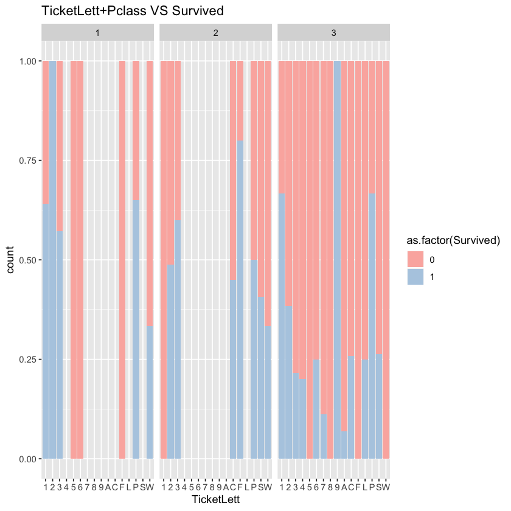


According to the chart, in the 1st and 2nd canbins, the correlationship between ticket and survival rate is not significant. However, the correlationship is significant in the 3rd cabin. 

Let's explore the effect of ticket on survival rate in the third class when we control the gender.


```R
ggplot(comp %>% filter(Set=='Train',Pclass==3))+geom_bar(aes(x=TicketLett,fill=as.factor(Survived)))+labs(title="TicketLett for Pclass3 VS Survived")
cTable <- xtabs(~as.factor(TicketLett)+as.factor(Survived),data=comp %>% filter(Set=='Train',Pclass==3,Sex=='female'))
chisq.test(cTable)
cTable <- xtabs(~as.factor(TicketLett)+as.factor(Survived),data=comp %>% filter(Set=='Train',Pclass==3,Sex=='male'))
chisq.test(cTable)
```

    Warning message in chisq.test(cTable):
    “Chi-squared approximation may be incorrect”


    
    	Pearson's Chi-squared test
    
    data:  cTable
    X-squared = 20.327, df = 10, p-value = 0.02631


    Warning message in chisq.test(cTable):
    “Chi-squared approximation may be incorrect”


    
    	Pearson's Chi-squared test
    
    data:  cTable
    X-squared = 27.251, df = 14, p-value = 0.01786


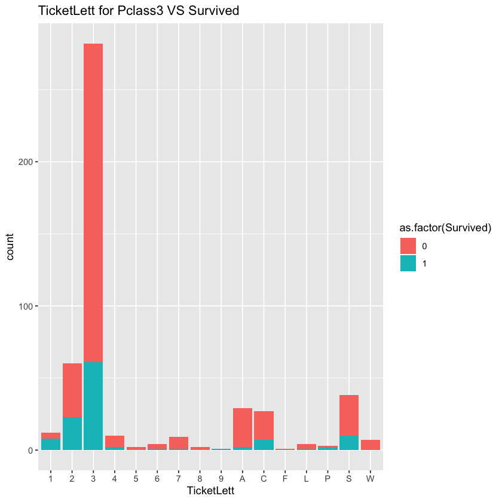


When we controld the sex, the effect of ticket is not significant any more. The result shows that significant level is about 0.99. Since there are many different levels of ticket and there are less passgeners holding ticketLetters with 5,6,8,9 and F, the Chi-sqaured test may not reflect real situation and the p-value tends to be significant. We should be more consevative and abandon this feature.

## 2.7 Cabin->CabinLett、CabinNo

Let's see whether there is helpful information in cabin.


```R
comp$CabinNo <- as.integer(ldply(strsplit(comp$Cabin,'([A-Z]| )+'),rbind)[[2]])
comp$CabinLett <- sapply(comp$Cabin,function(x) substr(x,1,1))
ggplot(comp %>% filter(Set=='Train',!is.na(CabinNo)))+geom_density(aes(x=CabinNo,fill=as.factor(Survived)),alpha=0.6)+labs(title="Cabin Number VS Survived")

```


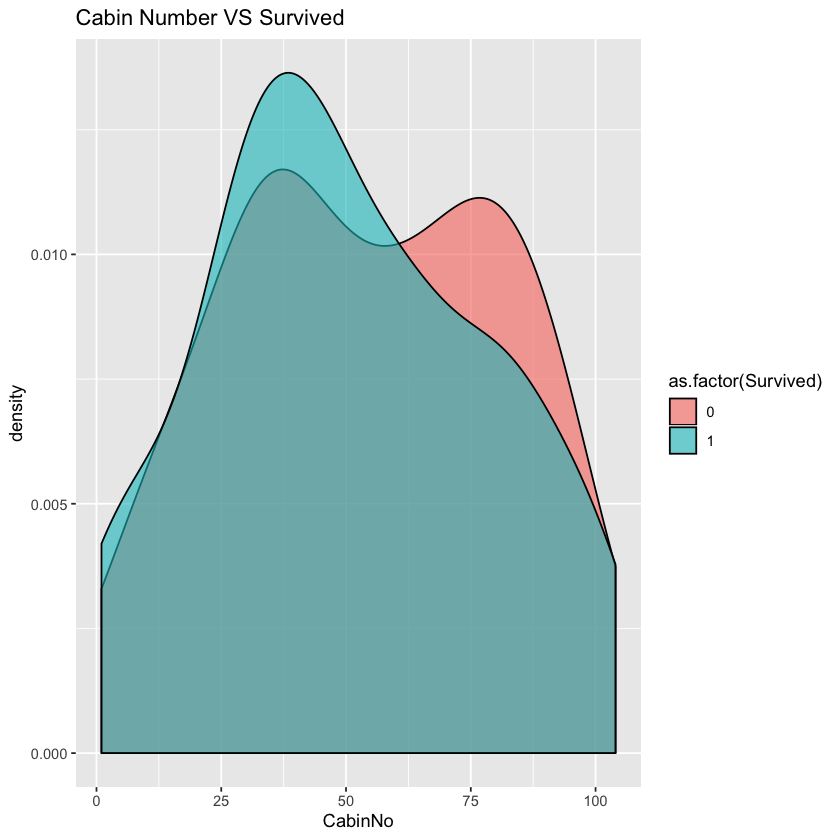


It seems that we can not get much helpful information from the chart. Since there are a lot of missing values in cabin of 2nd and 3rd class, we may ignore the effect of cabin on 2rd and 3rd class passenges. As almost all women in 1st class survived, we do not care about them and care more about men in 1st class. Let's test the correlation of cabinNo of men in 1st class with survival rate.


```R
data1 <- comp %>% filter(Set=='Train',Pclass==1,Sex=='male')
```


```R
library(polycor)
hetcor(data1$CabinNo,as.factor(data1$Survived))
```


    
    Two-Step Estimates
    
    Correlations/Type of Correlation:
                              data1$CabinNo as.factor.data1.Survived.
    data1$CabinNo                         1                Polyserial
    as.factor.data1.Survived.       -0.1196                         1
    
    Standard Errors:
                data1$CabinNo as.factor.data1.Survived. 
                                                  0.129 
    Levels:  0.129
    
    n = 94 
    
    P-values for Tests of Bivariate Normality:
                data1$CabinNo as.factor.data1.Survived. 
                                                 0.4613 
    Levels:  0.4613


As P value is not significant, we cannot reject the null hypothesis.

Let's check the relationship between cabin initial letter and survival rate. We only focus on male in 1st class.


```R
ggplot(comp %>% filter(Set=='Train',Pclass==1))+geom_bar(aes(x=CabinLett,fill=as.factor(Survived)),alpha=0.6)+labs(title="CabinLett+Pclass1 VS Survived")+scale_fill_brewer(palette = "Pastel1")
kruskal.test(Survived~as.factor(CabinLett),data=comp %>% filter(Set=='Train',Pclass==1,Sex=='male'))
```


    
    	Kruskal-Wallis rank sum test
    
    data:  Survived by as.factor(CabinLett)
    Kruskal-Wallis chi-squared = 5.6387, df = 6, p-value = 0.4648


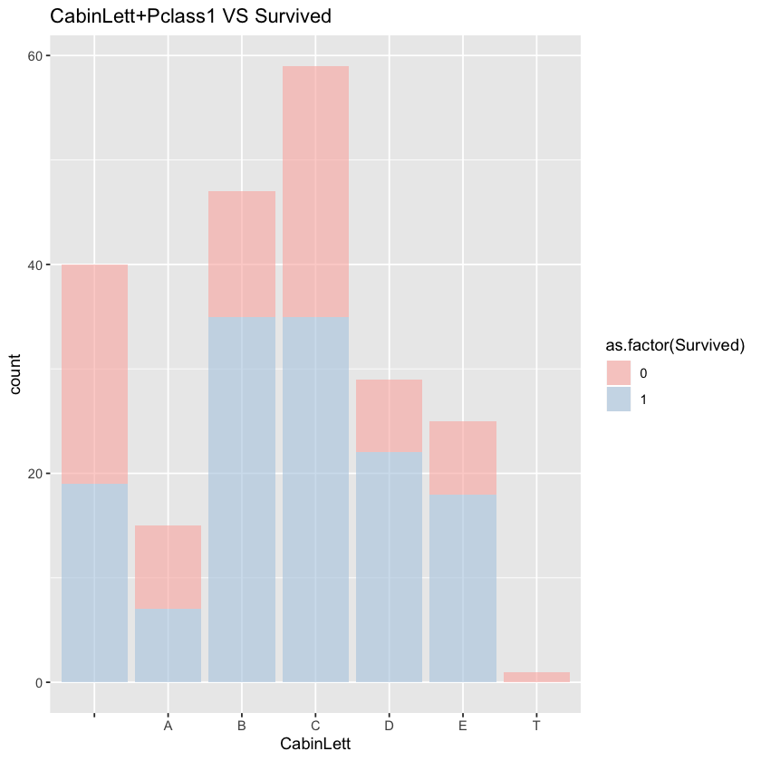


The relationship between cabin letter and survival rate is not significant.

## 2.8 Identify death pattern

After multiple tests, I found that in group sized 2,3 and 4, women and children may live together or die together.

Let's build family group first. Then we may calculate the group size, the number of women and children in the group, the number of victim children and women and the number of missing values in survival in the group. We may calculate the survival rate of those groups which do not have missing value of survival.


```R
comp$GroupName=NA
comp$GroupName <- apply(comp,1,function(x) ifelse((as.numeric(x['SibSp'])+as.numeric(x['Parch']))>0,paste0(x['Surname'],x['Fare']),'NotGroup'))
groupSurInfo <- comp %>% dplyr:::group_by(GroupName) %>% dplyr:::summarize(len = length(Survived),  wmChdLen = sum(as.numeric((Sex=='female'|Child=='Child'))),wmChdDthLen = sum(as.numeric((Sex=='female'|Child=='Child')&(Survived==0)),na.rm=T),wmChdNaLen = sum(is.na(Survived)&(Sex=='female'|Child=='Child')))
groupSurInfo <- groupSurInfo %>% mutate(wmChdDthRate=wmChdDthLen/wmChdLen)
viewGroup <- groupSurInfo %>% filter(len<=4,len>1,wmChdLen>1,wmChdNaLen==0)
ggplot(viewGroup)+geom_bar(aes(x=wmChdDthRate))+labs(title="Surviving rate of female and Children in every family ")+facet_grid(.~wmChdLen)
```


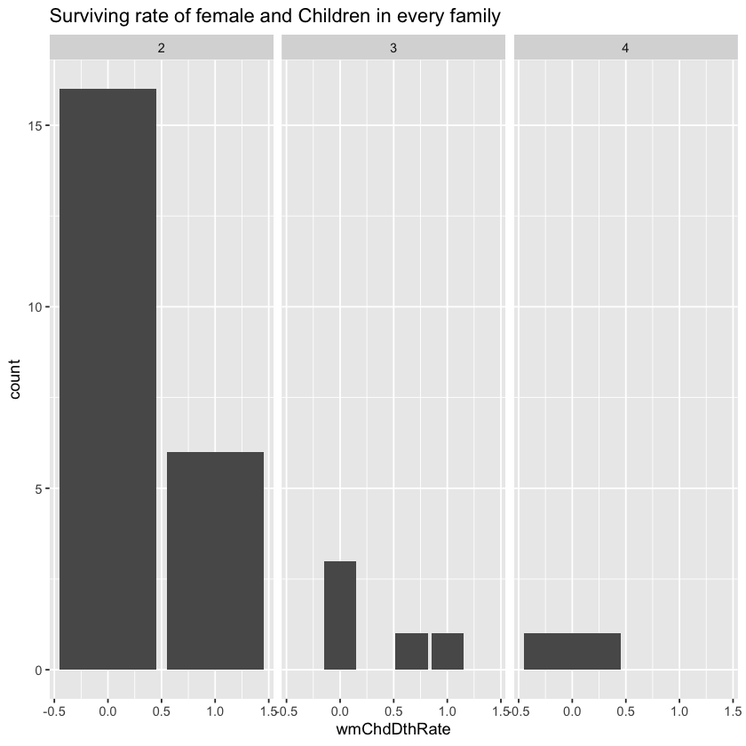


From the chart above, we can see that in these groups the death rate of women and children is either 0 or 100%. That is to say, all children and women in the group die together or live together. It is possible that mothers were not willing to leave their children so they stayer or board the lifeboat together.

Here it seems that adding the feature of whether women/children in the same group die may improve the result. But after consideration and try, I decided not to add them because these situations are relatively rare and may add noise to the whole model. Instead, I treat these passengers as male adult with title as Mr. The result proves that this method is better.


```R
targetGroup <- groupSurInfo %>% filter(len<=4,len>1,wmChdLen>1,wmChdDthLen>0,wmChdNaLen>0)
comp$Sex[comp$GroupName %in% targetGroup$GroupName & is.na(comp$Survived)] <- 'male'
comp$Child[comp$GroupName %in% targetGroup$GroupName & is.na(comp$Survived)]  <- 'Adult'
comp$Title[comp$GroupName %in% targetGroup$GroupName & is.na(comp$Survived)]  <- 'Mr'

```

## 2.9 Conversion

Convert categorical variables as factors. Split train and test set.


```R
comp$Child <- factor(comp$Child)
comp$Sex <- factor(comp$Sex)
comp$Embarked <- factor(comp$Embarked)
comp$Title <- factor(comp$Title)
comp$Pclass <- factor(comp$Pclass)
comp$GroupStyle <- factor(comp$GroupStyle)
train<- comp %>% filter(Set=='Train')
test <- comp %>% filter(Set=='Test')
```

# 3. Model 


```R
model <- randomForest(factor(Survived) ~ Pclass + Sex + Fare +Embarked + Title + GroupStyle + Child , data = train)
print(model)
varImpPlot(model, main = "importance of variables")
plot(model, main = 'Error of model')
legend('topright', colnames(model$err.rate), col=1:3, fill=1:3)
prdct <- predict(model, test)

```

    
    Call:
     randomForest(formula = factor(Survived) ~ Pclass + Sex + Fare +      Embarked + Title + GroupStyle + Child, data = train) 
                   Type of random forest: classification
                         Number of trees: 500
    No. of variables tried at each split: 2
    
            OOB estimate of  error rate: 16.84%
    Confusion matrix:
        0   1 class.error
    0 507  42  0.07650273
    1 108 234  0.31578947


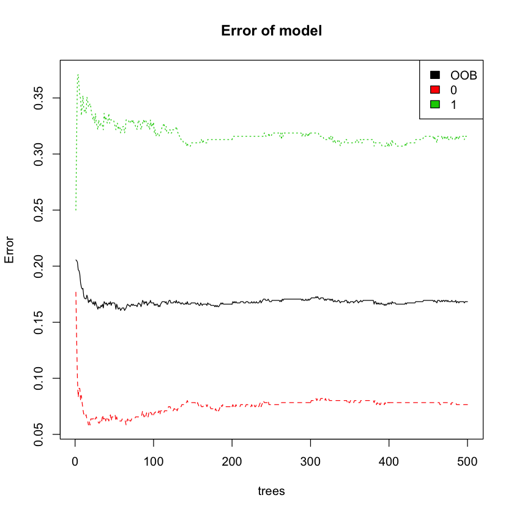


Pclass, Sex, Title, GroupSize and Child are prioritized variables. Considering that adding fare and embarked improves the model performance, I add these two variables into model as well. Title turns out to be the most important variable. It is probably becuase of the fact that it contains a lot of information about social ecnomic status.

From the chart, we can see that out of bag error remains stable as the number of trees increases. 

Final accuracy of model is 81%.

